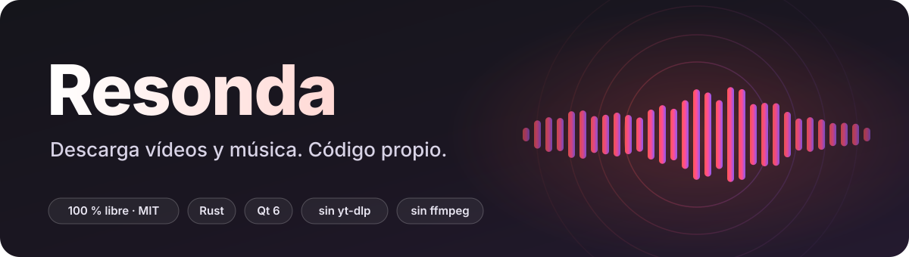

<p align="center">
  
</p>

<p align="center">
  <b>Descarga vídeos y música de YouTube y Spotify</b> a MP4, MP3, FLAC, WAV, M4A o AAC.<br>
  Código propio · 100 % libre (MIT) · sin yt-dlp ni ffmpeg
</p>

<p align="center">
  <a href="https://github.com/M1KE-27/resonda/releases/latest"><b>⬇ Descargas</b></a> ·
  <a href="#libre-de-verdad">Libre</a> ·
  <a href="#todo-hecho-aquí">Todo hecho aquí</a> ·
  <a href="#librerías-que-usamos">Librerías</a> ·
  <a href="#compilar-y-usar">Compilar</a>
</p>

---

## Descargas

Todo lo compilado está en la página de [**Releases**](https://github.com/M1KE-27/resonda/releases/latest):

| Sistema | Archivo | Qué es |
|---|---|---|
| **Linux, cualquier distro** | `Resonda-*-x86_64.AppImage` | La ventana, portable (lleva Qt dentro). `chmod +x` y a ejecutar |
| **Debian, Ubuntu y derivadas** | `resonda_*_amd64.deb` | Terminal y ventana. `sudo apt install ./resonda_*_amd64.deb` |
| **Linux, solo terminal** | `resonda-cli-*-linux-x86_64.tar.gz` | Un único binario, sin dependencias |
| **Windows** | `Resonda-*-windows-x64.zip` | `resonda.exe` (terminal) y `resonda-gui.exe` (ventana) |

Cada versión incluye `SHA256SUMS.txt` para comprobar los archivos. Los paquetes se compilan en GitHub Actions
(Ubuntu 22.04 y Windows), sin nada oculto: el flujo está en [`.github/workflows/release.yml`](.github/workflows/release.yml).

## Libre de verdad

- **Licencia [MIT](LICENSE)**: úsalo, cópialo, modifícalo, véndelo. No hace falta pedir permiso.
- **Sin cuentas, sin anuncios, sin telemetría.** La app solo habla con YouTube (`www.youtube.com`, sus servidores
  de vídeo y las miniaturas) y con Spotify (`open.spotify.com` y sus imágenes de portada).
- **Sin nada oculto**: son unas 5 000 líneas y caben en una tarde de lectura.

## Todo hecho aquí

Resonda **no usa ni incluye yt-dlp, youtube-dl, ffmpeg, spotDL ni ninguna otra herramienta de descarga**, y no lanza
ningún programa externo (compruébalo: `grep -rn "Command::new" src gui/src` no encuentra nada).
Lo que hace la app es código nuestro:

| Pieza | Qué hace |
|---|---|
| **Cliente de YouTube** | Abre una sesión anónima, elige el cliente que sirve el vídeo completo y busca vídeos |
| **Descargador** | Por trozos, en paralelo, con reintentos y cancelación limpia |
| **Muxer MP4** | Lee los MP4 fragmentados de YouTube y escribe un MP4 normal con vídeo y audio |
| **Extractor AAC** | Saca el audio a `.aac` (ADTS) sin recodificar |
| **Codificador FLAC** | Sin pérdida, con predictores fijos y decorrelación estéreo |
| **Escritor WAV** | PCM de 16 bits |
| **Etiquetas** | Título, artista, álbum, año y portada en MP4/M4A, MP3 (ID3v2), FLAC y WAV |
| **Spotify → YouTube** | Lee los datos de un enlace y elige la grabación que encaja (duración, título, artista) |
| **Ventana** | Interfaz Qt/QML con selector de servicios, formatos y progreso |

## Librerías que usamos

Solo cuatro dependencias directas (39 crates en total en Linux, casi todos TLS y utilidades) y Qt para la ventana:

| Librería | Para qué | Licencia |
|---|---|---|
| [`ureq`](https://crates.io/crates/ureq) | HTTPS (con `rustls`, sin OpenSSL) | MIT / Apache-2.0 |
| [`serde_json`](https://crates.io/crates/serde_json) | Leer las respuestas JSON | MIT / Apache-2.0 |
| [`symphonia-codec-aac`](https://crates.io/crates/symphonia-codec-aac) y `symphonia-core` | **Solo** decodificar AAC (para WAV, FLAC y MP3) | MPL-2.0 |
| [`rusty_mp3`](https://crates.io/crates/rusty_mp3) | Codificar MP3 | Apache-2.0 |
| [Qt 6](https://www.qt.io) (Quick, QuickControls2, Svg) | La ventana. Se enlaza dinámicamente | LGPL-3.0 |
| [Simple Icons](https://simpleicons.org) | Logos de los servicios | CC0-1.0 |

Los paquetes AppImage, `.deb` y Windows llevan Qt sin modificar; para cambiarlo basta con sustituir sus bibliotecas.
Los logos son marcas registradas de sus dueños: se usan solo para identificar cada servicio y Resonda no está afiliada
a ninguno. Puedes ver todas las dependencias con `cargo tree`.

### De dónde viene el conocimiento

Para entender cómo funcionan los clientes de YouTube estudiamos [yt-dlp](https://github.com/yt-dlp/yt-dlp)
(Unlicense) y para la idea de emparejar canciones de Spotify con vídeos, [spotDL](https://github.com/spotDL/spotify-downloader)
(MIT). Gracias a ambos proyectos. La lógica se reescribió desde cero en Rust: aquí no hay código suyo.

## Formatos

| Formato | Cómo se obtiene |
|---|---|
| **MP4** | Vídeo y audio unidos con nuestro muxer |
| **M4A · AAC** | El audio de YouTube tal cual, sin recodificar |
| **WAV · FLAC** | Decodificando el AAC (el escritor WAV y el codificador FLAC son nuestros) |
| **MP3** | Decodificando el AAC y codificando con `rusty_mp3` (128 a 320 kbps) |

## Compilar y usar

```sh
make cli        # terminal:  target/release/resonda
make gui        # ventana:   gui/build/resonda-gui   (make run la abre)
make test       # tests del núcleo
make clean      # borra lo compilado: el proyecto vuelve a ocupar unos 400 KB
```

Requisitos: Rust; para la ventana, Qt 6.5 o superior (Quick, QuickControls2 y Svg), CMake y Ninja.

```sh
resonda -f mp3 -b 256 <enlace>      # YouTube o Spotify (canción, álbum o playlist)
resonda -q 1080 <enlace>            # vídeo MP4 a 1080p
resonda --help
resonda-gui [enlace]
```

Para generar los paquetes de Linux: `packaging/build-linux.sh` (deja `.tar.gz`, `.deb` y AppImage en `dist/`).

## Estructura

```
.
├── Cargo.toml · Cargo.lock · Makefile · LICENSE
├── .github/workflows/           publicación (Linux y Windows) y pruebas
├── docs/                        banner del README
├── include/resonda.h            API C pública (la usa la ventana)
├── packaging/                   script de paquetes de Linux
├── src/                         núcleo en Rust
│   ├── main.rs                  línea de comandos
│   ├── lib.rs · ffi.rs · pipeline.rs · io.rs
│   ├── sources/                 youtube · spotify · matching · download
│   └── media/                   pcm · wav · flac · mp3 · tags
│       └── mp4/                 muxer MP4 (boxes, track, build, ilst, aac)
└── gui/                         ventana Qt6 / QML
    ├── src/                     capa C++ entre QML y el núcleo
    ├── qml/                     Main.qml · ServiceSetup.qml
    ├── assets/logos/            logos de los servicios (se incrustan en el binario)
    └── data/                    resonda.desktop · resonda.svg (icono)
```

## Aviso

Descargar contenido puede ir contra las condiciones de uso de YouTube y de Spotify, y el contenido que descargues tiene
sus propios derechos: úsalo con lo que sea tuyo o tengas permiso de guardar. De Spotify **solo se leen los datos**
(título, artista, portada); su audio, que está protegido con DRM, no se toca: cada canción se busca y se baja de YouTube.

## Licencia

[MIT](LICENSE) © 2026 Resonda contributors.
